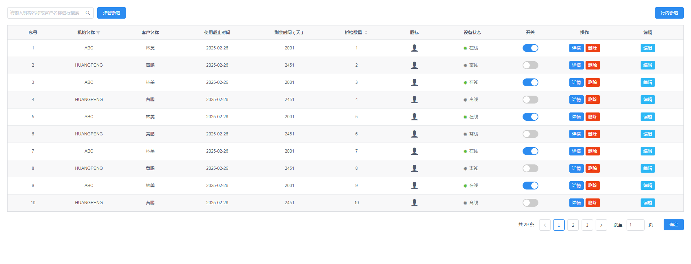

# table-demo

> 这是一款多功能表格，有搜索、筛选、排序、分页、新增、删除、编辑（表格行内编辑）、详情（跳转到详情页面）及render函数的用法

## Build Setup

``` bash
# install dependencies
npm install

# serve with hot reload at localhost:8080
npm run dev

# build for production with minification
npm run build

# build for production and view the bundle analyzer report
npm run build --report

# run unit tests
npm run unit

# run all tests
npm test
```

## demo效果图

